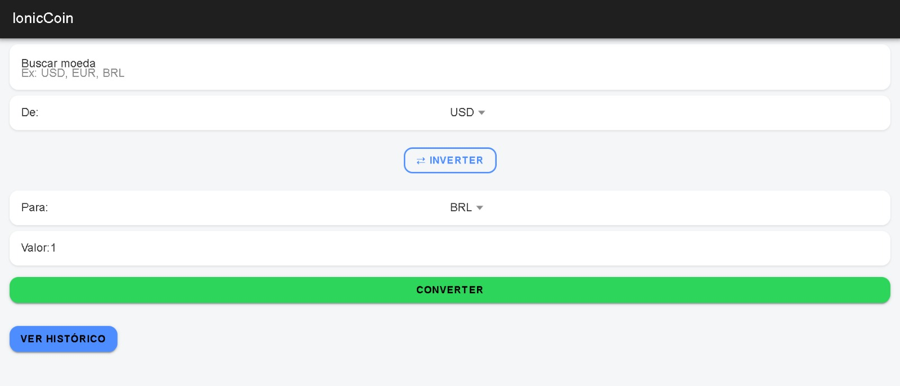
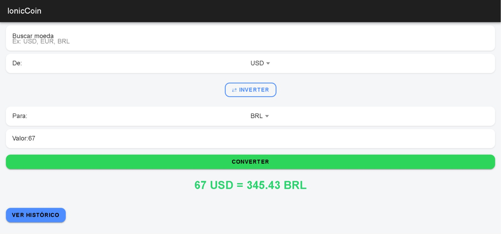
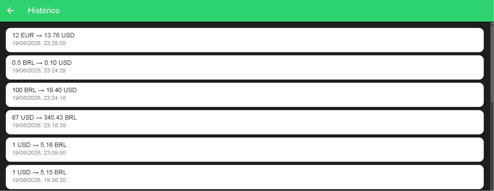

# # IonicCoin

App de conversão de moedas em tempo real, desenvolvido com **Ionic** e **Angular**, consumindo a API REST da [ExchangeRate-API](https://www.exchangerate-api.com/).

## Tecnologias utilizadas

- Ionic Framework
- Angular (Standalone Components)
- TypeScript
- ExchangeRate-API (taxas de câmbio em tempo real)
- LocalStorage (histórico e cache offline)

## Funcionalidades

- Conversão de moedas em tempo real, com seleção de moeda de origem e destino
- Busca/filtro de moedas por sigla, facilitando a navegação entre mais de 150 opções
- Conversão inversa com um toque (botão "Inverter")
- Histórico de conversões, salvo localmente e exibido em uma tela dedicada, com as conversões mais recentes no topo
- Atualização automática das taxas de câmbio a cada conversão e ao abrir o app
- Funcionalidade offline: caso a API esteja indisponível, o app utiliza as últimas taxas de câmbio salvas localmente

## Como rodar o projeto

```bash
npm install
ionic serve
```

O app abrirá automaticamente no navegador, em `http://localhost:8100`.

## Telas do projeto

**Tela inicial**



**Conversão realizada**



**Histórico de conversões**



## Licença

Este projeto está licenciado sob a licença MIT.